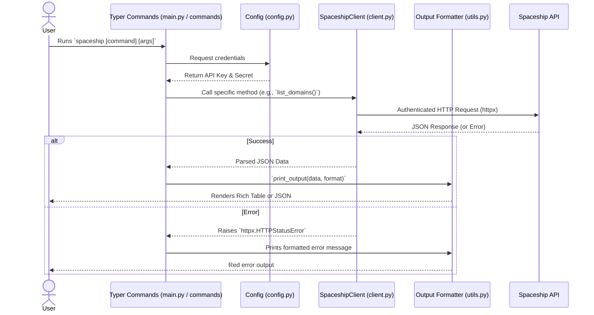

# Project: Spaceship.com DNS and Domain management tool

## General Instructions

- Documentation for spaceship.com public API should be read from here: <https://docs.spaceship.dev/>
- The online public API documentation should be the source in how to interact with the api's for different action, e.g. list domains, create DNS records, update DNS records, etc..
- Python Language should be used to create the tool or cli for interacting with the api
- Follow the existing condig style for all modifications
- Ensure all new code has comprehesive unit tests

## Python coding standards

- **PEP 8 Compliance**: Adhere to PEP 8 style guidelines for code formatting.
- **Type Hinting**: Use type hints (PEP 484) for function arguments and return values to improve code clarity and enable static analysis.
- **Docstrings**: Include docstrings for all modules, classes, and functions following PEP 257 conventions (e.g., Google or NumPy style).
- **Error Handling**: Use specific exception handling (`try/except`) rather than catching broad `Exception` classes. Define custom exception classes for domain-specific errors.
- **Logging**: Use the standard `logging` library instead of `print` statements. Log errors with stack traces and use appropriate log levels (INFO, DEBUG, ERROR).
- **Modern String Formatting**: Prefer f-strings over `%` formatting or `.format()`.
- **Linting and Formatting**: Use tools like `black` for formatting and `pylint` or `ruff` for linting.
- **Virtual Environments**: Always use a virtual environment for dependency management, use uv for virtual environment management.
- **Compatibility**: Should target Python 3.10 and higher versions.
- **Imports**: Organize imports according to PEP 8 (standard library, third-party, local application).
- **Complexity**: Keep functions small and focused on a single task.
- **Quality Score**: Maintain a Pylint score of 10/10 for all production and test code.

## CI/CD and Code Quality

- **Automated Linting**: A GitHub Action using `super-linter` (slim version) is used to enforce code quality on every push to `develop` and on every pull request to `main`.
- **Linter Configuration**: The following linters must be active and passing: `black`, `ruff`, `pylint`, `mypy`, `hadolint` (Docker), `markdownlint`, `yamllint`, and `jsonlint`.
- **Action Security**: All GitHub Actions used in the pipeline must be pinned to a specific, immutable SHA digest rather than a mutable tag (e.g., use `actions/checkout@34e1148...` instead of `@v4`).
  - **Pinning Syntax**: To comply with the 80-character line length limit enforced by `yamllint`, long action strings should be declared using the YAML folded block scalar (`>-`) syntax. This keeps the SHA digest on its own line and allows for a version comment on the following line for readability.
- **Local Verification**: Before pushing changes, developers MUST verify code quality locally after every code change. This should be done using either the project's standardized `super-linter` Docker command or by running each individual linter (`black`, `ruff`, `pylint`, `mypy`, `hadolint`, `markdownlint`, `yamllint`, and `jsonlint`) to ensure all checks pass before submission.

## Docker Best Practices

- **Multi-stage Builds**: The `Dockerfile` employs a two-stage build process to keep the final image size minimal.
  - **Stage 1 (Builder)**: Uses `python:3.12-slim-bookworm` to install dependencies via `uv`, sync the project, and compile the application into a standalone binary using PyInstaller.
  - **Stage 2 (Runtime)**: Uses a minimal `debian:bookworm-slim` base image.
- **Security**: The runtime container operates under a dedicated, non-root user (`spaceshipcli`) to adhere to the principle of least privilege.
- **Minimal Footprint**: Only the compiled PyInstaller binary and necessary `ca-certificates` (for secure API requests) are copied to the runtime stage.
- **Build Caching**: The `uv` dependency installation is separated from the source code copy (`uv sync --frozen --no-install-project` run beforehand) to leverage Docker layer caching efficiently.
- **Metadata**: Docker images must include OCI-compliant labels (Title, Description, Version, Source) provided via the `VERSION` build argument.

## Automated Semantic Versioning

- **Tooling**: [GitVersion](https://gitversion.net/) is used to automatically determine the semantic version of the application.
- **Workflow**: The project uses a "Mainline" (Trunk-Based) versioning strategy.
  - Every commit on `main` increments the version.
  - `develop` and feature branches use pre-release labels (e.g., `-dev`, `-pr`).
- **Conventional Commits**: Commit messages must follow the Conventional Commits specification to trigger correct version bumps:
  - `feat:` or `feature:` -> Minor bump.
  - `fix:` or `patch:` -> Patch bump.
  - `break:`, `breaking:`, or `BREAKING CHANGE:` -> Major bump.
- **CLI Implementation**: The application must provide a `--version` (and `-v`) flag that displays the version string in the format `spaceshipcli vX.Y.Z`. This should be implemented using `importlib.metadata` to read the version from the package.
- **CI Orchestration**: The GitHub Actions pipeline must use a dedicated `versioning` job to provide a consistent version string to all subsequent build and deployment jobs.

## Description of Project

I would like to create a cli tool in Python to interact with the api of spaceship.com a domain registration and web services platform, they have an API that can be used to interact with their service, unfortunately there is no cli to interact with the API's

The API documentation is available here which you can read: <https://docs.spaceship.dev/>, this has documentation about the API.

## Requirements

The cli should do the following:

- Read API keys either from the .env file or from environment variables, SPACESHIP_API_KEY and SPACESHIP_API_SECRET, if not set provide return informing the user the fact SECRET and KEY are not ser, more information <https://docs.spaceship.dev/#section/Spaceship-API/Authentication>
- Include a help command that outputs information on how to use the cli
- Commands must support output formatting. The default format should be human-readable rich tables. A `--format json` flag must be available on all commands to output raw JSON responses.
- I want to be able to do the following actions using the cli:
  - Get/List operations to implement:
    - Get a list of domains
    - Get information for 1 domain or all domains
    - Check domains availability for registration
    - Get personal nameservers on a domain
    - Get personal nameservers configuration (This is not available yet, currently returns HTTP 501, so please ignore)
    - Get the details of the domain transfer
    - Get domain auth code
    - Get domain resource records list
    - Add DNS records
    - Delete DNS records
- The cli should be an executable in the end, compiled binary
- Please create tests that allow to test cli functionality every code change.

## Planned Tasks (CRUD Operations)

### DNS Record Write/Save
**Goal:** Implement the ability to add or set DNS records for a specific domain without deleting existing records. Also, support bulk additions using a JSON file.
**Command:** `spaceshipcli dns add`

**Implementation Steps:**
1.  **API Client Update (`client.py`)**:
    - Add `replace_dns_records(self, domain: str, records: list[dict], force: bool = False)` using `PUT /v1/dns/records/{domain}`.
2.  **CLI Command Update (`dns.py`)**:
    - Add `add` command accepting options for `--domain` (required), `--type`, `--name`, `--value` (or `--address`), and `--ttl`.
    - Accept a `--file` (or `-f`) option for bulk importing records from a JSON file.
    - **Merging Logic**: Before sending the `PUT` request, the command must fetch the existing records (`GET /v1/dns/records/{domain}`), append the new record(s) matching the format, and then send the complete merged list via `PUT`.
    - Output a rich table listing the records that were just created/updated and their status.
3.  **Documentation (`README.md`)**:
    - Add clear examples showing how to add single records and bulk records via JSON.
4.  **Testing (`test_dns.py`)**:
    - Add `respx.mock` tests to verify the `GET` (fetch) + `PUT` (merge and save) workflow.
    - Add tests for JSON file bulk imports.

### DNS Record Delete
**Goal:** Implement the ability to delete specific DNS records for a domain. Support both single record deletion via CLI flags and bulk deletion using a JSON file.
**Command:** `spaceship dns delete`

**Implementation Steps:**
1.  **CLI Command Update (`dns.py`)**:
    - Add `delete` command accepting options for `--domain` (required), `--type`, `--name`, and optionally `--value`.
    - Accept a `--file` (or `-f`) option for bulk specifying records to delete from a JSON file.
    - **Filtering Logic**: Fetch all existing records (`GET /v1/dns/records/{domain}`). Filter out any records that match the specified deletion criteria. Send the remaining list via `PUT /v1/dns/records/{domain}`.
    - Output a rich table listing the records that were deleted and their status.
2.  **Documentation (`README.md`)**:
    - Add clear examples showing how to delete single records and bulk records via JSON.
3.  **Testing (`test_dns.py`)**:
    - Add `respx.mock` tests to verify the `GET` (fetch), filter out, and `PUT` (save) workflow for both single and bulk deletions.

### DNS Record Update
**Goal:** Implement the ability to update an existing DNS record's value or TTL in-place.
**Command:** `spaceship dns update`

**Implementation Steps:**
1.  **CLI Command Update (`dns.py`)**:
    - Add `update` command accepting options for `--domain` (required), `--type` (required), `--name` (required), `--current-value` (optional), `--new-value` (optional), and `--new-ttl` (optional).
    - **Logic**: Fetch all existing records. Identify the matching record by type, name, and optionally current-value (required if duplicates exist). Update its value or TTL, and save the updated list via `PUT`.
    - Output a rich table showing the updated record and its status.
2.  **Documentation (`README.md`)**:
    - Add clear examples showing how to update a record's value or TTL.
3.  **Testing (`test_dns.py`)**:
    - Add `respx.mock` tests to verify successful updates and error cases (like missing record, ambiguous record match).

## Architecture and Code Flow

The Spaceship CLI is designed to be modular. This means we split the program into different files, each with a specific job.

### How it Works (For Everyone)

Think of this CLI tool like a well-organized **Restaurant**:

1.  **`main.py` (The Front Desk / Host):** 
    When you run a command like `spaceship domains list`, this is the first place you go. `main.py` looks at what you want to do and points you to the right department.
2.  **`commands/*.py` (The Waitstaff):** 
    These files (like `domains.py`, `dns.py`) take your specific order. For example, `domains.py` knows exactly what information is needed to "list domains" or "check availability". It gathers your instructions and prepares the order.
3.  **`config.py` (The Security Check):** 
    Before anything leaves the restaurant, we need to prove who we are. `config.py` acts like a security guard that grabs your secret `SPACESHIP_API_KEY` and `SPACESHIP_API_SECRET` from your environment so the kitchen knows you're allowed to order.
4.  **`client.py` (The Kitchen / Delivery System):** 
    This is the engine. The `SpaceshipClient` takes the order from the waitstaff, packages it up with your security credentials, and sends it over the internet to Spaceship.com's real servers. It then waits for the response and brings the raw data back.
5.  **`utils.py` (The Plating & Presentation Team):** 
    The raw data from Spaceship.com is messy. `utils.py` takes that messy data and formats it beautifully into the colorful, easy-to-read tables you see on your screen.

### Technical Component Overview

*   **`main.py`**: The entry point. Sets up the primary Typer application and mounts the subcommands.
*   **`commands/*.py`**: Typer sub-applications that parse arguments, handle user input, and call the respective methods in the API client.
*   **`client.py`**: Contains `SpaceshipClient`, a wrapper around `httpx`. Responsible for making authenticated HTTP requests to the Spaceship API.
*   **`config.py`**: Uses `pydantic-settings` to securely load the API key and secret.
*   **`utils.py`**: Handles all console output using the `rich` library, rendering tables or JSON.

### Execution Flow Diagram

